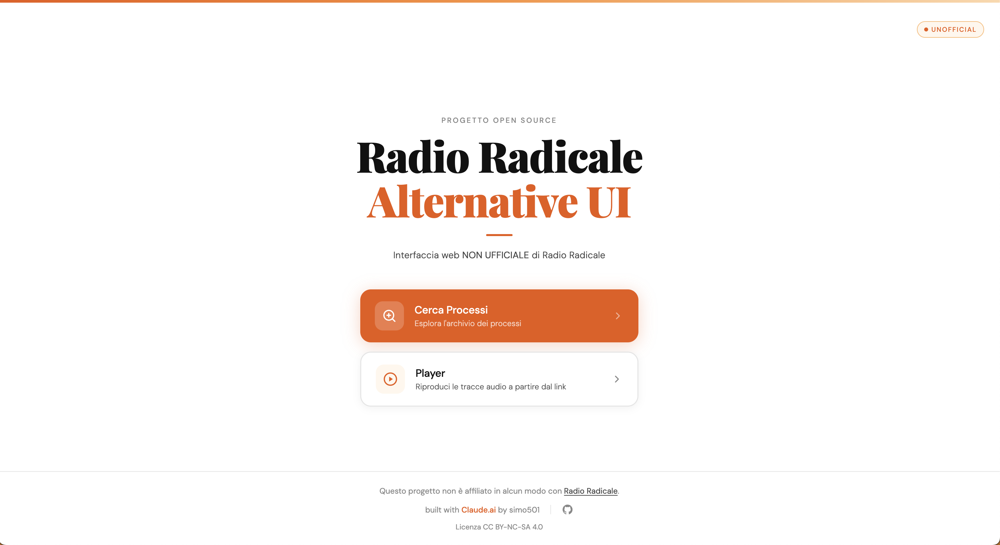
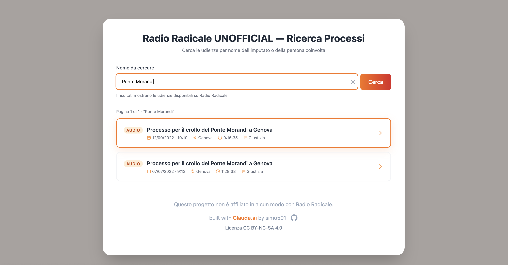
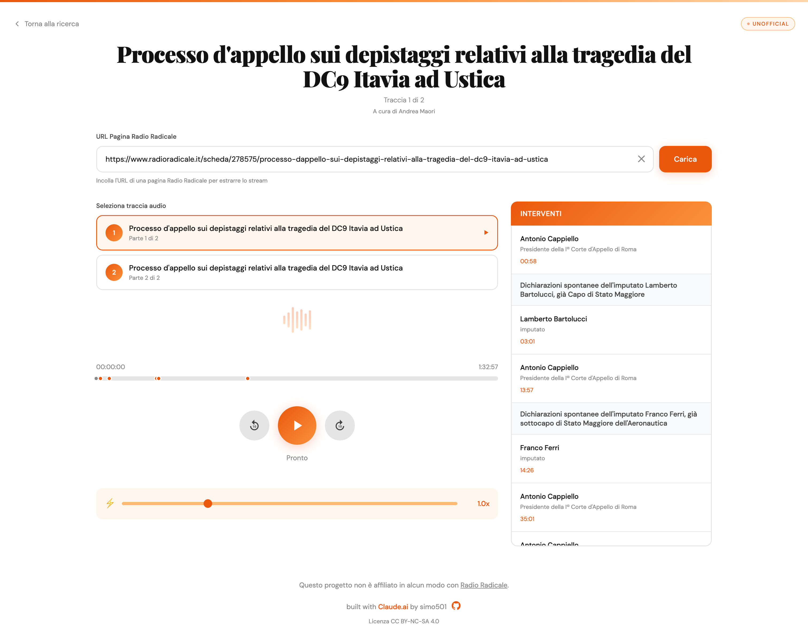

# Radio Radicale Alternative UI

_unofficial (not affiliated with Radio Radicale)_

Built with ```claude sonnet 4.5``` to explore the model's capabilities and potential

**serverless and static-hosting ready**

## Under the hood (dead simple)

Radio Radicale uses **HLS** (Http Live Streaming)

#### HLS (briefly)

The streaming file it's split into smaller segments

A `.m3u8` file (called _playlist_) keep track of these segments sequentially in order to piece together the stream

### Idea

The `player`'s core idea is to parse the **playlist** and use it as the audio source, enabling deployment on static web hosting 

The `search` simply sends a request to the endpoints used by the original website and then parse the returned html 


# Gallery

(it scales nicely on mobile)





# LICENSE 

CC-BY-NC-SA 4.0 